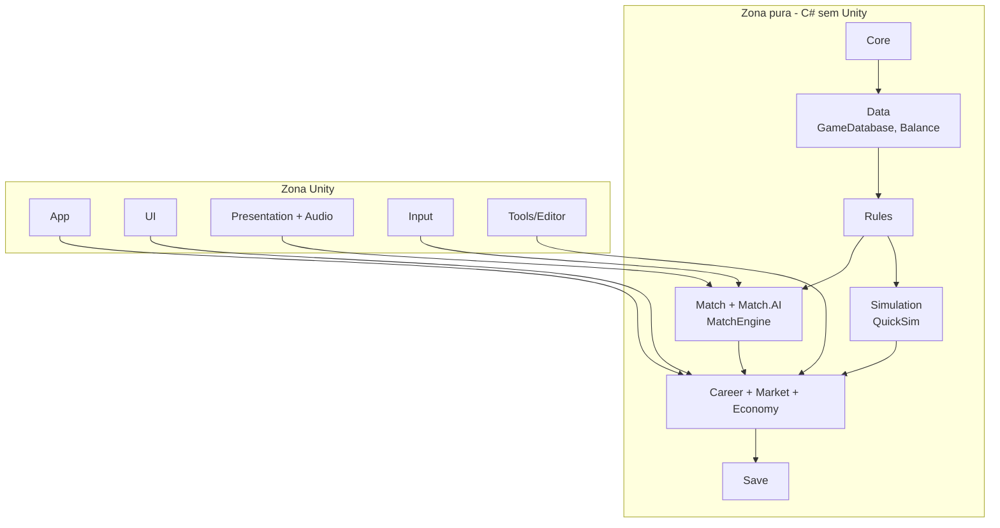
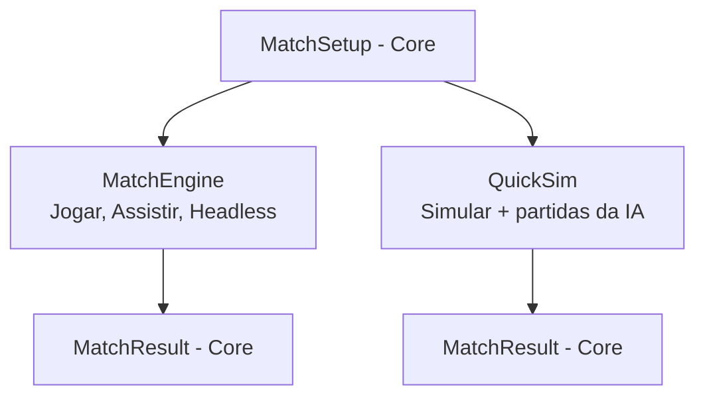

# ARCHITECTURE.md

Fonte: Especificação Técnica (autoridade técnica). Este documento consolida a arquitetura; não introduz decisões novas.

## 1. Visão geral: duas zonas

- **Zona pura (C# sem Unity):** toda a lógica do jogo — regras, partida, simulação, carreira, economia, save.
- **Zona Unity:** apresentação, input, UI, ciclo de vida da plataforma, acesso a arquivos.

Dependências apontam sempre da zona Unity para a zona pura.

(Seta = "é usado por". Ex.: Data é usado por Rules.)

## 2. O que NÃO pode depender da Unity

Tudo em: `Core`, `Data`, `Rules`, `Match`, `Match.AI`, `Simulation`, `Career`, `Career.Market`, `Career.Economy`, `Save`.

Nessas assemblies é proibido: `UnityEngine.*`, `Time`, `UnityEngine.Random`, `ScriptableObject`, `MonoBehaviour`, `Vector3` da Unity (usar `System.Numerics`), `Application.persistentDataPath` (usar `IFileStore`), logs da Unity (usar interface de log do Core).

Garantias: asmdef com `noEngineReferences: true` + solution .NET paralela que compila esses fontes fora da Unity.

## 3. Assemblies e dependências permitidas

| Assembly | Zona | Pode depender de |
| --- | --- | --- |
| Core | Pura | — (contém os contratos `MatchSetup`/`MatchResult`, D-19) |
| Data | Pura | Core |
| Rules | Pura | Core, Data |
| Match | Pura | Core, Data, Rules |
| Match.AI | Pura | Core, Data, Rules, Match |
| Simulation | Pura | Core, Data, Rules |
| Career | Pura | Core, Data, Rules, Match, Simulation |
| Career.Market | Pura | Core, Data, Rules, Career |
| Career.Economy | Pura | Core, Data, Rules, Career |
| Save | Pura | Core, Data, Career, Career.Market, Career.Economy |
| App | Unity | Todas as puras, UI, Presentation, Input, Audio |
| Input | Unity | Core, Match |
| Presentation | Unity | Core, Data, Match |
| Audio | Unity | Core, Match |
| UI | Unity | Core, Data, Career (+ Market, Economy), Simulation |
| Tools (Editor) | Unity Editor | Todas |
| Tests | — | Assembly testada |

Proibido: `Match` → `Career`; qualquer pura → Unity; `Simulation` → `Match`; `Match` → `Simulation`; contratos do `Core` → qualquer outra assembly.

Nota (D-19): `MatchSetup`, `MatchResult` e os tipos de dados que eles carregam (incluindo `MatchEvent`) são contratos do `Core`, em uma área dedicada (ex.: `Core/Contracts/Match`). Por isso `Match` e `Simulation` não dependem um do outro: ambos dependem só do `Core` para o contrato. Os contratos são dados simples (Ids, valores de atributos, parâmetros de tática, condição, semente), sem referência a `Data`, `Rules` ou `Career`.

## 4. Fluxo de dados

1. **Boot:** App carrega `GameDatabase` (JSON validado) e lista saves (cabeçalhos).
2. **Carreira:** UI chama serviços (`CareerService.Advance()`, `MarketService.MakeOffer()`); serviços validam, alteram `CareerState` e emitem notificações.
3. **Partida:** Carreira monta `MatchSetup` → `MatchEngine` (jogar) ou `QuickSim` (simular) → `MatchResult` → Carreira aplica.
4. **Save:** Save serializa `CareerState` completo.

## 5. Tipos centrais

### MatchSetup (Core)
Entrada de qualquer partida: os dois times (escalação, reservas, tática, batedores, capitão), condição dos jogadores (energia, moral, forma), competição e regras (substituições), mando, duração configurada, semente. Imutável.

### MatchState
Estado completo da partida em tempo real: bola, 22 jogadores (cinemática, energia, intenção), posse, placar, relógio, fase, estado do árbitro/reinício, controle humano, RNG da partida. **Serializável** (snapshot ao ir para segundo plano). Existe só no `MatchEngine`.

### MatchResult (Core)
Saída única dos dois motores: placar, lista de `MatchEvent`, estatísticas por time e jogador, notas, energia final, lesões, cartões, substituições. Imutável.

### CareerState
Tudo que o save persiste: mundo (clubes, jogadores, contratos, staff, instalações, finanças), temporada atual (calendário, edições, tabelas), manager, objetivos, negociações abertas, notícias, histórico, estado dos RNGs, semente do mundo.

### GameDatabase
Definições imutáveis do app: balanceamento e curvas (`Balance`), formações, formatos de competição, templates, pools de nomes, textos de notícias, regras. Carregado de JSON da pasta `Data/` na raiz do repositório (D-09), validado no carregamento. A mesma pasta é lida pela Unity e pela solution .NET/headless; em build, uma cópia gerada por etapa de empacotamento pode ser incluída no app, sem virar fonte da verdade (nunca `StreamingAssets` como fonte).

### SaveGame
Cabeçalho (`schemaVersion`, clube, temporada, data, tempo jogado) + corpo (`CareerState`) + checksum. Ver seção 10.

## 6. Ids

- Toda entidade do mundo tem `Id` inteiro, único e estável no save.
- Relações por Id; índices reconstruídos após carregar.
- Ids nunca reaproveitados dentro de um save.

## 7. RNG determinístico

- Gerador próprio, semeável, na zona pura (`Core`).
- Semente da carreira → fluxos derivados por sistema (Matchday, Development, Market, Youth...) e por partida.
- Alterar um sistema não altera a sequência aleatória dos outros.
- Estado dos RNGs persistido no save.
- Determinismo exigido no mesmo aparelho e build; entre aparelhos não é requisito.

## 8. Eventos

- **Partida:** a cada passo, eventos em buffer reutilizável (`Kicked`, `Goal`, `Foul`, `Save`, `OutOfPlay`, `Card`, `Substitution`...). Consumidos pela Presentation, Audio, MatchStats e testes. Sem alocação por evento no loop.
- **Carreira:** eventos de domínio por data (resultado aplicado, proposta recebida, janela abriu...) que alimentam `News` e notificações da UI.

## 9. Serviços de aplicação

Camada fina (na zona pura, usada pela UI) que expõe casos de uso: avançar calendário, escalar, negociar, renovar, melhorar instalação, iniciar partida, aplicar resultado, salvar. A UI nunca altera entidades diretamente.

## 10. Save

JSON + gzip; cabeçalho separado; `schemaVersion`; cadeia de migrações `vN → vN+1` sobre JSON bruto; validação (checksum, integridade referencial, invariantes); escrita atômica; 3 backups; autosave definido; snapshot separado de partida em andamento. Acesso a disco via `IFileStore` implementado no App.

## 11. Entidades

Player (blocos: Identity, Attributes, Potential, Positions, Condition, Economics, Stats, ScoutView), Club, MatchTeam, Competition (def), CompetitionEdition, Season, Fixture, MatchResult, MatchEvent, Contract, Transfer, Negotiation, Staff, Facility, Finance, LedgerEntry, Manager, Objective, Tactic, Formation (def), NewsItem, SaveGame. Detalhes em `TECHNICAL_SPEC.md` §4.

## 12. UI, Presentation e Input

- **Input:** converte toques em comandos abstratos com carimbo de passo; fila consumida pelo `MatchEngine`.
- **Presentation:** interpola snapshots entre passos; anima, posiciona câmera, radar, VFX, vibração; nunca altera estado.
- **Audio:** reage a eventos.
- **UI:** presenter por tela lendo serviços; UI Toolkit; strings em tabelas.

## 13. MatchEngine × QuickSim

| | MatchEngine | QuickSim |
| --- | --- | --- |
| Uso | Jogar, (Assistir pós-MVP), headless em testes | "Simular" do jogador e todas as partidas da IA |
| Modelo | Posições, física, IA, árbitro em passo fixo | Posses/fatias estatísticas, sem posições |
| Entrada/saída | `MatchSetup` → `MatchResult` (contratos do Core) | `MatchSetup` → `MatchResult` (contratos do Core) |
| Compartilham | `Balance` (efeitos), força de time por setor, regras de falta/cartão/lesão, fadiga, IA de substituição, fórmula de notas | idem |
| Coerência | Testes de calibração comparam distribuições | idem |

## 14. Career Simulator × Unity

O simulador de carreira (calendário + sistemas + QuickSim + economia + mercado) é inteiramente puro. A Unity só: mostra telas, dispara serviços, carrega a cena `Match` quando o jogador escolhe Jogar e devolve o `MatchResult`, e persiste arquivos via `IFileStore`. Critério: 10+ temporadas completas rodam em `dotnet test` sem Unity.

## 15. Cenas

`Boot`, `Shell` (todas as telas de menu/carreira, retrato), `Match` (paisagem), mais sandboxes de desenvolvimento. Ver `TECHNICAL_SPEC.md` §15.
