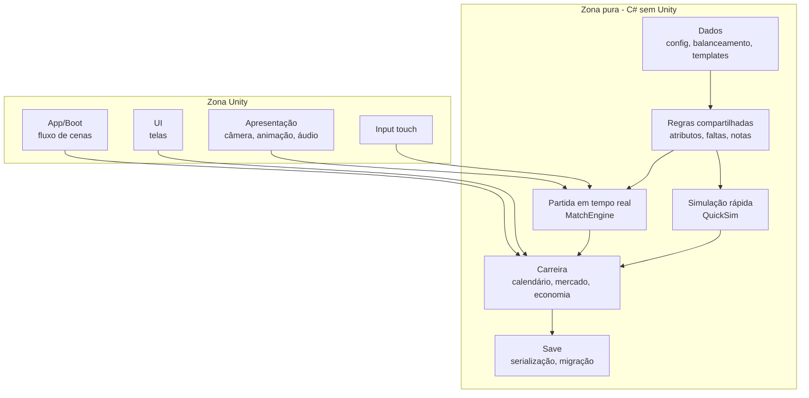

# TECHNICAL_SPEC.md

Autoridade técnica do projeto (arquitetura, tecnologia, estrutura, sistemas, testes). Consolidado da Especificação Técnica de 25/09/2026, sem decisões novas. Itens marcados **PENDENTE** estão em `DECISIONS.md`. O escopo do MVP é definido em `MVP_SCOPE.md`: esta especificação descreve a arquitetura-alvo, que pode suportar mais do que o MVP implementa.

## 1. Resumo técnico

**Unity 6 (LTS) + C#, Android primeiro, com o núcleo do jogo (regras, partida, simulação, carreira, economia, save) em C# puro, sem dependência da Unity.** A Unity entra só como camada de apresentação, input e plataforma. Isso permite testar tudo por linha de comando, rodar milhares de partidas e temporadas sem renderizar e trocar a apresentação sem reescrever o núcleo.

Pilares da arquitetura:

1. **Estado separado de apresentação:** a partida é uma simulação em passo fixo que produz estado e eventos; câmera, animação e áudio apenas leem.
2. **Duas resoluções de partida, um modelo de regras:** a engine em tempo real (jogável) e a simulação rápida (QuickSim) compartilham atributos, curvas de balanceamento, regras de falta/cartão/lesão e o formato de resultado. A QuickSim é calibrada contra a engine real rodando sem render.
3. **Tudo que é balanceamento é dado:** curvas e tabelas em arquivos versionados, nunca números mágicos no código.
4. **Dados do jogo ≠ estado do save:** regras e templates são imutáveis e vêm com o app; o mundo (clubes, jogadores gerados, histórico) vive no save.
5. **Determinismo por semente:** mesma semente + mesmas entradas = mesmo resultado, no mesmo aparelho. Base para testes, replays e depuração.

### Inconsistências encontradas entre os documentos

| # | Inconsistência | Onde | Decisão nesta especificação |
| --- | --- | --- | --- |
| 1 | GDD fala em 14 atributos; Partida define 18 | GDD §3 vs Partida §11 | 18 atributos (Partida prevalece) |
| 2 | Fadiga definida "por segundo", mas a duração real da partida é configurável (4, 6 ou 10 min). Um jogo de 10 min cansaria 2,5× mais que um de 4 min | Partida §3 vs GDD §1 | Gasto de energia normalizado pela duração: taxas definidas para a duração de referência (6 min) e multiplicadas por 6 / duração escolhida. O gasto total por partida fica igual em qualquer duração |
| 3 | Formato de competições: GDD §5 (20 clubes, grupos, quadrangulares) vs GDD §11 (MVP: 16 clubes, pontos corridos) | GDD | Engine de competições data-driven que suporta os dois; MVP usa pontos corridos com 16 clubes |
| 4 | Tiro de meta pedido na spec, mas não definido no documento Partida | Partida §13 | Definição mínima proposta (seção 5), marcada como decisão a confirmar |
| 5 | Calendário do GDD §2 inclui estadual em jan–abr; MVP exclui estaduais | GDD §2 vs §11 | Calendário gerado por dados; sem estadual, a temporada do MVP começa com liga + copa |
| 6 | GDD propõe "protótipo só de carreira primeiro"; a ordem de implementação da Partida começa pela física da bola | GDD §11/§13 vs Partida §16 | Não decidi: é a decisão pendente nº 1 (seção 22). O roadmap suporta as duas ordens |
| 7 | Velocidades em m/s reais (7–9,5 m/s) com relógio acelerado (90 min em 6 min) | Partida §3 | Não é erro: jogadores se movem em tempo real, só o relógio do placar é acelerado. "Minutos jogados" usam o relógio do jogo |

## 2. Engine escolhida

**Escolha: Unity 6 LTS com C#.** O fator decisivo não é popularidade: o projeto depende de C# maduro em Android (núcleo em C# puro, testável fora da engine), de profiling mobile confiável e de um pipeline 3D com animação humanoide pronto para 22 personagens.

| Critério | Unity 6 | Godot 4 | Observação |
| --- | --- | --- | --- |
| Android | Maduro, amplamente usado em jogos mobile | Maduro com GDScript; **C# no Android ainda experimental** ([docs Godot](https://docs.godotengine.org/es/stable/tutorials/export/exporting_for_android.html)) | Decisivo: nosso núcleo é C# |
| Celulares de entrada | URP com ajustes de qualidade por aparelho | Renderizador Mobile e Compatibility (OpenGL) | Ambos viáveis; Unity tem mais casos documentados |
| 3D low-poly + câmera broadcast | Excelente | Bom | Empate técnico |
| Animação humanoide (22 atletas, retarget) | Mecanim com retarget humanoide nativo; muitos pacotes de animação de futebol | Retarget existe, ecossistema menor | Vantagem Unity |
| Física própria da bola | C# puro, sem PhysX | C# ou GDScript | Irrelevante: física é nossa |
| IA de 22 jogadores | C# compilado (IL2CPP) | C# experimental em Android; GDScript mais lento | Vantagem Unity |
| UI mobile com listas grandes | UI Toolkit (listas virtualizadas) e uGUI | Control nodes bons | Empate, com ressalva de maturidade do UI Toolkit em runtime |
| Save | C# puro + JSON | Idem | Empate |
| Testes automatizados | Unity Test Framework (NUnit), batchmode por CLI; núcleo roda com `dotnet test` | GUT/gdUnit | Vantagem Unity |
| Profiling | Profiler, Memory Profiler, Frame Debugger no aparelho Android | Profiler integrado, menos profundo em mobile | Vantagem Unity |
| Tamanho do app | Base maior (runtime + IL2CPP) | Menor | Vantagem Godot, não decisiva |
| Custo | Personal grátis até US$ 200 mil de receita+financiamento anual em 2026 ([Unity](https://unity.com/products/pricing-updates)) | Gratuito, MIT | Unity sem custo no estágio atual |
| Manutenção longo prazo | Histórico de mudanças de licenciamento | Open source | Mitigado pelo núcleo em C# puro |

**Descartadas:** Unreal (pesado para celulares de entrada, C++, build grande), frameworks 2D/web (não atendem à câmera broadcast 3D).

**Quando Godot seria melhor:** se o núcleo fosse GDScript, ou quando o C# no Android sair de experimental. Como o núcleo é C# puro e isolado, migrar custaria reescrever apresentação, input e UI — não regras, simulação e carreira.

**Stack Unity proposta:** URP, Input System (toque), UI Toolkit para menus, Cinemachine opcional, Addressables só se o tamanho exigir, IL2CPP + ARM64. **PENDENTE:** usar Cinemachine ou câmera própria (decidir antes de A2, quando a câmera de jogo começa).

## 3. Requisitos técnicos

Categorias: **Requisito** (não se lança sem), **Meta** (buscada, renegociável com dados), **Valor inicial de teste** (ponto de partida para medir). Nenhum número foi medido ainda.

| Item | Categoria | Valor | Observação |
| --- | --- | --- | --- |
| Plataforma inicial | Requisito | Android (ARM64) | iOS depois; núcleo não depende de Android |
| Orientação | Requisito | Menus em retrato, partida em paisagem | Troca só na entrada/saída da cena Match |
| FPS da partida | Meta | 60 fps em intermediário | |
| FPS mínimo aceitável | Requisito | 30 fps estáveis em aparelho de entrada | Queda em chute/gol é pior que 30 constante |
| FPS dos menus | Meta | 60 fps, limitado em telas paradas | Bateria |
| Passo da simulação | Valor inicial | 50 Hz fixo | Ajustável após profiling |
| Aparelhos-alvo | Requisito a definir | Um de entrada e um intermediário físicos | Decisão pendente |
| Memória | Valor inicial | < ~600 MB na partida em aparelho de 3–4 GB | Medir com Memory Profiler |
| App → menu | Meta | ≤ 5 s em intermediário | |
| Menu → partida | Meta | ≤ 5 s | |
| Avançar uma data | Meta | ≤ 1 s percebido; nunca travar a UI | Thread de fundo ou fatiado |
| Tamanho do app | Meta | < ~150 MB | Conferir limites da Play Store antes do lançamento |
| Android mínimo | Requisito a definir | Pela Unity 6 e pelo nível de API exigido pela Play Store no ano | Mudam anualmente |
| Tamanho do save | Meta | Poucos MB após 10 temporadas | Histórico antigo vira resumo |
| Offline | Requisito | 100% offline | |

### Preparado para expansão

- Competições, formatos, formações, traits e instalações entram como dados.
- Novo campo no save não quebra saves antigos (migração versionada).
- iOS exige trocar apenas plataforma e build.
- Dados licenciados futuros entram por um "pacote de dados" que substitui o gerador de mundo.

## 4. Arquitetura geral

Dez sistemas em duas zonas. A **zona pura** (C# sem Unity) contém toda a lógica; a **zona Unity** só apresenta, recebe input e acessa a plataforma. Dependências sempre da zona Unity para a pura, nunca o contrário.



| Sistema | Responsabilidade | Zona |
| --- | --- | --- |
| Dados | Configuração imutável: balanceamento, curvas, formações, formatos, nomes, templates | Pura |
| Regras compartilhadas | Efeito de atributos, falta/cartão/lesão, nota, estatísticas | Pura |
| Partida em tempo real | Passo fixo de 22 jogadores + bola + árbitro; comandos → estado e eventos; com ou sem render | Pura |
| Simulação rápida | Resolve partida em milissegundos, mesmo `MatchResult` | Pura |
| Carreira | Calendário, competições, elenco, mercado, economia, desenvolvimento, objetivos | Pura |
| Save | Serializar, versionar, migrar, validar, backup | Pura (arquivo via interface) |
| UI | Telas, navegação, binding, HUD | Unity |
| Apresentação | Interpolação, animação, câmera, radar, áudio, efeitos, vibração | Unity |
| Input | Toques → comandos abstratos | Unity |
| App | Boot, dados, save, fluxo de cenas, ciclo de vida Android | Unity |

### Como os sistemas conversam

- **Carreira → Partida:** `MatchSetup` (times, escalações, táticas, condição, competição, semente) para MatchEngine ou QuickSim.
- **Partida → Carreira:** `MatchResult` (placar, eventos, estatísticas, notas, energia, lesões, cartões). A Carreira aplica; nenhuma partida escreve no mundo.
- **Partida → Apresentação:** snapshots interpolados + fluxo de eventos (`Kicked`, `Goal`, `Foul`, `Save`).
- **Input → Partida:** fila de comandos consumida no próximo passo (buffer de 150 ms).
- **UI → Carreira:** serviços de aplicação (`CareerService.Advance()`, `MarketService.MakeOffer()`); a UI nunca altera entidades.
- **Carreira → Save:** serializa um `CareerState` completo.

### Regra de independência

A carreira completa (com partidas via QuickSim) deve rodar em teste de linha de comando, sem cena Unity, por 10+ temporadas. Se algum sistema precisar da Unity para isso, a arquitetura está errada.

### 4.1 Modelos de dados

Três camadas:

- **Definições (GameDatabase):** imutáveis, no app.
- **Mundo (WorldState, no save):** gerado no início da carreira e evolui.
- **Transitório:** partida em andamento, caches, índices.

**Referências por Id inteiro estável**, nunca por referência de objeto.

| Entidade | Finalidade | Principais propriedades | Relações | Fixo | Muda |
| --- | --- | --- | --- | --- | --- |
| Player | Atleta | Identidade, atributos, potencial, posições, estado | Club (via Contract), Injury, Stats | Nome, nascimento, altura, pés, nacionalidade | Atributos, estado, contrato, estatísticas |
| Club | Instituição | Nome, sigla, UF, cores, escudo, reputação, torcida, divisão, instalações, finanças | Players, Staff, Facility, Finance, Competition | Nome, cores, UF, escudo | Reputação, divisão, torcida, finanças |
| Team (MatchTeam) | Recorte do clube para uma partida | 11 titulares, reservas, tática, batedores, capitão | Club, Player, Tactic | — | Transitório |
| Competition (def) | Regra de competição | Tipo, formato, fases, nº de clubes, desempate, acesso/queda, premiação | CompetitionFormat | Tudo | — |
| CompetitionEdition | Edição numa temporada | Participantes, fases, tabela, chaveamento | Competition, Club, Match | Participantes | Tabela, resultados |
| Season | Um ano | Calendário, edições, janelas, objetivos | Edition, Objective | Estrutura | Progresso |
| Fixture | Partida agendada | Data, edição, fase, mandante, visitante, semente | Club, Edition | Data, confronto | Resultado |
| MatchResult | Resultado persistido | Placar, eventos, estatísticas, notas | Fixture, Player | Tudo | Histórico antigo vira resumo |
| MatchEvent | Evento | Minuto, tipo, jogadores, dados | MatchResult | Imutável | — |
| Contract | Vínculo | Salário, início, fim, cláusula, status prometido, empréstimo | Player, Club | Termos | Substituído na renovação |
| Transfer | Registro | Jogador, origem, destino, valor, data, tipo | Player, Club | Imutável | — |
| Negotiation | Em andamento | Partes, rodada, oferta, etapa, paciência | Player, Club | — | Até encerrar |
| Staff | Comissão | Função, nível 1–5, salário, contrato | Club | Função | Nível, contrato |
| Facility | Instalação | Tipo, nível, obra, manutenção | Club | Tipo | Nível, obra |
| Finance | Contas | Caixa, orçamento, teto salarial, verba, lançamentos | Club, LedgerEntry | — | Tudo |
| LedgerEntry | Lançamento | Data, categoria, valor, referência | Finance | Imutável | — |
| Manager | Jogador humano | Nome, clube, reputação, confiança, histórico | Club | Nome | Reputação, confiança |
| Objective | Meta da diretoria | Tipo, parâmetros, prazo, peso, status | Season, Club | Após definido | Status |
| Tactic | Tática | Formação, mentalidade, linha, pressão, largura, laterais, batedores, presets | Formation, Club | — | Editada |
| Formation (def) | Formação | 11 slots com posição-base, função, zona | — | Tudo | — |
| NewsItem | Notícia | Data, tipo, template + parâmetros, referências, lida | Qualquer | — | Lida; expira |
| SaveGame | Container | Cabeçalho + CareerState (mundo, manager, temporada, RNG) + checksum | Tudo | — | Tudo |

### 4.2 Sistema de jogadores

| Bloco | Conteúdo | Quem altera | Frequência |
| --- | --- | --- | --- |
| `PlayerIdentity` | Id, nome, nacionalidade, nascimento, altura, pé dominante, pé ruim, seed de avatar | Ninguém | Nunca |
| `PlayerAttributes` | 18 valores 1–99 em array indexado por enum `Attr` | Desenvolvimento, lesão grave | Semanal/anual |
| `PlayerPotential` | Potencial oculto, variação da curva, traits | Geração | Quase nunca |
| `PlayerPositions` | Principal + até 2 secundárias com proficiência | Desenvolvimento | Rara |
| `PlayerCondition` | Energia, moral, forma, lesão ativa, suspensões e amarelos por competição | Partidas, calendário | Por data |
| `PlayerEconomics` | Valor (cache), salário (via contrato), status de venda | Mercado | Mensal |
| `PlayerStats` | Por temporada e competição; carreira resumida | Partidas | Por partida |
| `PlayerScoutView` | Faixas conhecidas por clube observador | Scouting | Por observação |

- Atributos em array indexado por enum (iterar, testar, mapear curvas).
- Idade calculada, não armazenada.
- OVR calculado com cache invalidado.
- Contrato é entidade separada.
- Atributos de goleiro no mesmo array; jogadores de linha têm valores baixos, não nulos.

## 5. Arquitetura da partida jogável

O **MatchEngine** é C# puro que avança um `MatchState` em passos fixos (50 Hz inicial). Nenhum sistema lê relógio real, `Time.deltaTime` ou `Random` global.

### Ordem por passo

1. Comandos (fila de input).
2. IA (três camadas).
3. Ações (passes, chutes, desarmes, carrinhos, cabeceios).
4. Movimento.
5. Bola.
6. Colisões e contatos.
7. Árbitro.
8. Relógio e fase.
9. Eventos.

### Sistemas

| Sistema | Responsabilidade | Entradas | Saídas | Depende de | Determinístico | Testável isolado |
| --- | --- | --- | --- | --- | --- | --- |
| Pitch | Geometria (105×68 m inicial), áreas, gols, zonas | Config | Consultas geométricas | — | Sim | Sim |
| Ball | Estado e integração da bola | Chutes, colisões | Posição, previsão | Pitch, BallConfig | Sim | Sim |
| PlayerBody | Cinemática e energia | Intenção | Estado | Atributos, MovementConfig | Sim | Sim |
| Movement | Aceleração, curva, sprint, com bola | Intenção | Velocidade | Curvas | Sim | Sim |
| Fatigue | Gasto/recuperação normalizados | Intensidade, duração | Energia, multiplicadores | Resistência | Sim | Sim |
| Possession | Controle, toques, bola solta, domínio | Posições, bola | Dono, eventos | Ball, Drible | Sim | Sim |
| PassSystem | Todos os passes, cone, erro | Comando, direção, força | Trajetória, alvo | Rules, Ball | Sim | Sim |
| ShotSystem | Chute, colocado, cabeça | Comando, contexto | Trajetória | Rules, Ball | Sim | Sim |
| DribbleSystem | Toques, cortes, finta, arrancada, proteção | Intenção com bola | Bola, finta | Possession, Movement | Sim | Sim |
| DefenseSystem | Contenção, desarme, carrinho, interceptação, 2º defensor | Comandos + IA | Tentativas, contatos | Possession, Rules | Sim | Sim |
| Contact | Separação, disputas, contato | Posições, tentativas | Posições, contatos | Força, Desarme | Sim | Sim |
| Goalkeeper | Posicionamento, reação, defesa, saída, cruzamentos | Trajetória prevista | Intenção + defesa | Ball, GK | Sim | Sim |
| Referee | Faltas, cartões, impedimento, saídas, gol, reinícios | Contatos, passes, bola | Decisões | Rules, Pitch | Sim | Sim |
| Restart | Lateral, tiro de meta, escanteio, falta, pênalti, saída | Decisão, comando | Execução | Pass/Shot, Formation | Sim | Sim |
| Substitution | Validar e aplicar trocas | Pedido | Elenco em campo | Regras | Sim | Sim |
| TacticsRuntime | Tática e presets em jogo | Mudança | Parâmetros de IA | Formation, Tactic | Sim | Sim |
| AI | Seção 7 | Estado, tática | Intenções | Todos | Sim | Sim (cenários) |
| ControlSelection | Controle, troca automática/manual | Estado, comandos | Controlado, candidato | Ball | Sim | Sim |
| MatchClock | Relógio acelerado, tempos, acréscimos | Passos | Minuto, fases | Config | Sim | Sim |
| MatchStats | Estatísticas e notas | Eventos | Estatísticas | Rules | Sim | Sim |
| InputAdapter (Unity) | Toques → comandos | Touch | Comandos | Input System | Não | Com toques gravados |
| MatchView (Unity) | Interpolação, animação, câmera, radar, HUD, áudio | Snapshots + eventos | Imagem e som | MatchEngine | Não precisa | Parcial |

### Tiro de meta (proposta, a confirmar)

Goleiro com a bola, analógico escolhe direção, **Passe** = saída curta, **Alto** = bola longa; IA posiciona pelo bloco. IA decide curta/longa pela mentalidade e pressão adversária.

### Snapshot e pausa

`MatchState` inteiro serializável: ao ir para segundo plano, salva; ao voltar, restaura pausado.

## 6. Física da bola

Física própria em C# puro, sem PhysX. As mesmas fórmulas integram e **preveem** a trajetória.

| Elemento | Especificação |
| --- | --- |
| Representação | Ponto com raio ~0,11 m: posição 3D, velocidade 3D, spin lateral, estado (`Controlled`, `Rolling`, `Airborne`, `Dead`), último toque |
| Unidades | m, s, m/s; x comprimento, y largura, z altura |
| Rolando | Desaceleração constante; parada em forma fechada |
| No ar | Gravidade + arrasto linear leve; queda em forma fechada (aproximada) |
| Efeito | Aceleração lateral proporcional ao spin, só em colocado, cruzamento e falta; spin decai |
| Quique | vz × 0,45–0,60 (inicial), vxy × ~0,85; abaixo de mínimo vira `Rolling` |
| Trave/travessão | Cilindros, reflexão com perda; interseção por segmento |
| Rede | Amortecimento forte; evento `NetHit` |
| Gol | Cruzamento completo da linha entre postes, abaixo do travessão (segmento) |
| Saída | Cruzamento completo da linha → `Dead` + evento |
| Posse | Bola presa à frente do pé; toques com impulso por velocidade e Drible |
| Bola solta | Tempo até alcançar; primeiro no raio captura; empate por Força/Agilidade |
| Bola parada | `Dead` fixa até o reinício |
| Colisão com jogadores | Por regra, aplicada como impulso |

Custo constante; sub-passos só em chute forte. Coeficientes em `BallConfig`.

**Determinismo:** `float` em passo fixo é determinístico no mesmo aparelho e build (suficiente para single-player). Se virar requisito entre aparelhos, migrar para ponto fixo nesta camada.

## 7. IA dos 22 jogadores

Campos de posição-alvo + regras locais com pontuação simples. Nada de planejamento pesado.

| Camada | Frequência inicial | Saída |
| --- | --- | --- |
| Time | 5 Hz | Fase, altura e largura do bloco, pressionador, lado da bola |
| Função | 10 Hz | Posição-alvo por slot |
| Individual | 10 Hz escalonado | Intenção |
| Movimento | 50 Hz | Aplicação física |

### Camada do time

- Estados: `Build`, `Attack`, `TransitionAtk`, `TransitionDef`, `Defend`, `SetPiece`.
- Bloco: linha defensiva, altura, deslocamento lateral.
- Linha: sobe com bola para trás/portador pressionado; recua com portador livre.
- Pressão: 0, 1 ou 2 pressionadores.

### Camada da função

- Alvo = posição-base transformada pelo bloco (escala por fase, translação 0,4–0,6 para o lado da bola, limite de impedimento).
- Compactação como clamp de distância entre linhas.
- Posicionamento baixo = erro e atraso maiores.

### Camada individual

- Marcação por zona com entrega; cruzamento com atribuição gulosa 1-para-1.
- Cobertura quando o defensor é batido.
- Apoio: ~8 pontos candidatos pontuados.
- Ruptura: espaço atrás, não impedido, portador com Visão acima do limiar.
- Decisão com bola: nota = chance de sucesso × valor da situação; Visão define nº de opções; Compostura reduz ruído; dificuldade define tempo e risco.

### Eficiência e segurança

- Força bruta 22×22 é barata; otimizar só após profiling.
- Anti-loop: compromisso mínimo e máximo por intenção; detector de oscilação nos testes.
- Mesma IA para o time humano sem bola e para o modo Assistir.

## 8. Atributos (sistema data-driven)

**Nenhum sistema lê atributo diretamente para calcular efeito.** Tudo passa por `Balance.Eval(Effect.X, jogador)`.

- **`Effect` (enum):** `SprintSpeed`, `AccelTime`, `TurnSpeedLoss`, `PassAngleError`, `PassBallSpeed`, `ShotAngleError`, `ShotPowerMax`, `DribbleTouchDistance`, `TackleWinChance`, `FoulChance`, `GkReactionTime`, `GkDiveReach`, `PressureErrorMult`, `EnergyDrainMult`...
- **`EffectDefinition`:** 1–3 atributos com pesos, curva, faixa, unidade.
- **Curva:** pontos com interpolação linear por partes; a regra de percepção (5 pontos imperceptível, 15+ óbvio) vive na curva.
- **Modificadores:** energia, moral, forma, fora de posição, traits — antes ou depois da curva, em ordem fixa.

**Dados em JSON versionado** (`Data/Balance/effects.json`, `movement.json`, `ball.json`, `economy.json`), não ScriptableObjects, porque testes e simulação fora da Unity precisam ler os mesmos valores. Editor na Unity pode editar gravando JSON.

**Validação:** schema, faixas, monotonicidade, todo `Effect` definido, todo atributo usado em algum efeito (senão falha de build).

| Atributo | Efeitos |
| --- | --- |
| Velocidade | SprintSpeed, JogSpeed |
| Agilidade | AccelTime, DecelTime, TurnSpeedLoss, TurnRecoverTime, LooseBallReaction |
| Resistência | EnergyDrainMult, LateMatchPenalty, InjuryChance |
| Força | BodyDuelWin, ShieldStrength, AerialDuel |
| Passe | PassAngleError, PassPowerError, PassBallSpeed |
| Cruzamento | CrossAngleError, CrossQuality |
| Drible | DribbleTouchDistance, FeintSuccess, FirstTouchError, TurnSpeedLoss com bola |
| Finalização | ShotAngleError (área), FinesseAccuracy |
| Chute de longe | ShotAngleError (fora), ShotPowerMax, FreeKickAccuracy |
| Cabeceio | HeaderAccuracy, HeaderPower, AerialDuel |
| Desarme | TackleWinChance, FoulChance (inverso), ShotBlockChance |
| Visão | ThroughBallError, LeadCalcError, AiPassOptionsCount, RunTriggerThreshold |
| Posicionamento | AiTargetError, AiCorrectionDelay |
| Compostura | PressureErrorMult, BigMatchErrorMult, PenaltyAimWobble |
| Reflexo | GkReactionTime, GkDiveReach |
| Posicionamento GK | GkAngleError, GkRushDecisionQuality |
| Jogo aéreo GK | GkCrossClaimRange, GkCrossDecisionQuality |
| Mãos GK | GkCatchChance, GkDistributionError |

A QuickSim usa os mesmos efeitos em forma agregada.

## 9. Táticas e formações

**Formação (dados):** 11 slots com posição-base normalizada, papel (`GK`, `CB`, `FB`, `DM`, `CM`, `AM`, `W`, `ST`), posições compatíveis, zona de responsabilidade. MVP: 4-4-2, 4-3-3, 4-2-3-1.

**Tática:** formação + mentalidade (1–5), linha (1–3), pressão (1–3), largura (1–3), laterais (1–3), batedores, presets.

| Controle | Parâmetros afetados (`tactics.json`) |
| --- | --- |
| Mentalidade | Altura do bloco, jogadores além da linha da bola, risco |
| Linha defensiva | x-alvo da linha, subida para impedimento |
| Pressão | Distância de disparo, nº de pressionadores, duração da transição, energia |
| Largura | Escala lateral do bloco |
| Laterais | Deslocamento x dos `FB`; cobertura pelo `DM` |

**Durante a partida:** parâmetros trocam na hora; bloco recalcula no próximo ciclo (≤ 200 ms) com suavização de 1–2 s. Troca de formação remapeia por menor deslocamento e compatibilidade.

## 10. Simulação de partida

Uma entrada (`MatchSetup`) e uma saída (`MatchResult`) idênticas em todos os modos.

| Modo | Motor | Uso | Custo |
| --- | --- | --- | --- |
| Jogar | MatchEngine + render + input | Partida do jogador | Tempo real |
| Assistir | MatchEngine + render, IA nos dois | Pós-MVP | Tempo real |
| Simular (QuickSim) | Estatístico | "Simular" do jogador + todas as partidas da IA | Milissegundos |
| Headless | MatchEngine sem render | Testes, calibração | Segundos no PC |

MatchEngine headless para tudo travaria o "Avançar" no celular; a coerência vem de regras compartilhadas + calibração.

| Compartilhado | Como |
| --- | --- |
| Atributos e curvas | Mesmo `Balance` |
| Força de time por setor | Função única (ataque, criação, defesa, aéreo, goleiro) |
| Falta, cartão, lesão, suspensão | Mesmas probabilidades base em `Rules` |
| Fadiga | Mesma curva por intensidade |
| Substituições | Mesmas regras e IA |
| Notas | Mesma fórmula |
| Resultado | `MatchResult` único |

### Algoritmo da QuickSim

1. Forças por setor ajustadas por tática, energia, moral, mando.
2. Posse por fatia pela força de meio-campo.
3. Progressão para ataque perigoso: criação vs defesa.
4. Chute com xG por tipo de jogada, finalizador ponderado por posição e atributo.
5. Resultado do chute pelas curvas de finalização e goleiro.
6. Eventos paralelos: faltas, cartões, escanteios, lesões.
7. Fadiga e substituições.
8. Notas por contribuições.

Coeficientes em `quicksim.json`.

### Calibração

N partidas headless vs N QuickSim com mesmos confrontos, comparando: gols e % de 0×0; finalizações, no alvo, escanteios, faltas, cartões; posse por diferença de força; **curva diferença de OVR → vitória/empate/derrota**; sensibilidade por atributo. Tolerâncias em config; teste falha fora da faixa. Antes do MatchEngine existir, calibrar contra metas de design.

## 11. Carreira

Simulador de mundo por datas: `CareerState` + sistemas processados ao avançar até o próximo ponto que exige o jogador.

| Dados do jogo (imutável, no app) | Estado do save (CareerState) |
| --- | --- |
| Balanceamento, curvas, economia por divisão | Clubes, jogadores, contratos, staff, instalações |
| Formatos de competição e pirâmide | Edições da temporada, tabelas, resultados |
| Templates de clube, escudo, nomes, UFs | Calendário gerado |
| Formações, traits, instalações, staff | Finanças e lançamentos |
| Objetivos e textos de notícias | Manager, confiança, objetivos, notícias |
| Regras | Negociações, observação, histórico |
| Parâmetros do gerador de mundo | RNG e semente |

Atualizar o balanceamento afeta saves existentes; mudanças que invalidam o mundo exigem migração.

### Calendário

- Unidade: dia de jogo. Gerado dos formatos, com intervalo mínimo entre jogos e janelas.
- Eventos: partidas, janelas, fim de mês, início de ano, fim de temporada.

### Sistemas (ordem fixa por data)

| Sistema | Quando | O que faz |
| --- | --- | --- |
| Matchday | Datas com partidas | Resolve partidas, tabela, suspensões |
| Condition | Toda data | Energia, lesões, moral, forma |
| Development | Semanal + anual | Evolução/queda, aposentadorias |
| Injury | Após partidas | Aplica lesões |
| Finance | Evento + mensal | Lançamentos, caixa negativo |
| Market | Janelas + livres | IA de mercado, propostas, negociações |
| Contracts | Mensal + fim | Vencimentos, pré-contratos, renovações |
| Facilities | Por data | Obras |
| Board | Turno + fim | Confiança, objetivos, demissão |
| Reputation | Fim + títulos | Reputações |
| Youth | Início do ano | Jovens da base |
| SeasonTransition | Fim | Acesso/rebaixamento, prêmios, nova temporada, arquivamento |
| News | Após os demais | Notícias |

Cada sistema é classe pura `(CareerState, data, RNG próprio, GameDatabase)`, com fluxo de RNG próprio.

**Histórico:** temporadas antigas guardam campeões, tabelas finais, artilheiros, transferências relevantes e agregados; eventos detalhados só da temporada atual.

## 12. Mercado de transferências

| Componente | Especificação |
| --- | --- |
| Valor de mercado | Função de OVR, idade, potencial, contrato, forma, divisão (`market.json`); lote mensal + ao mudar de clube |
| Salário de referência | OVR e reputação, por divisão |
| Interesse do jogador | Reputação relativa + divisão + salário + tempo de jogo + traits; abaixo do limiar recusa |
| Aceite do vendedor | Oferta ≥ valor × fator (importância, contrato, finanças) |
| Negociação | `ClubStage` → `PlayerStage` → `Done`/`Failed`; até 3 rodadas; paciência; persistida |
| Contratos | Criação, vencimento, pré-contrato, renovação, rescisão |
| Livres | Pool indexado por posição e OVR |
| Jovens | Base anual e clubes da IA; potencial oculto |
| Scouting | `PlayerScoutView` com faixas que estreitam |

### IA do mercado

1. Necessidades por clube; clubes sem necessidade não processam.
2. Índice de candidatos por posição × OVR × valor, reconstruído por janela.
3. Limite de ações por data e por clube.
4. Propostas ao humano limitadas por janela.
5. Clubes mantêm 20–26 jogadores; lacunas completadas com gerados.

## 13. Economia

- **Livro-caixa único:** todo movimento é `LedgerEntry`; saldo = soma; relatórios são agregações.
- **Categorias:** TV, bilheteria, patrocínio, premiações, vendas, empréstimos, produtos | salários, staff, manutenção, compras, obras.
- **Geradores** puros com parâmetros em `economy.json` por divisão.
- **Orçamento** no início da temporada; remanejamento em dados (remanejamento e preço de ingresso ajustável estão fora do MVP).
- **IA usa a mesma economia**, para os testes detectarem inflação e falência.
- **Escala por divisão** (~10× D→A) é parâmetro.

## 14. Save

| Aspecto | Especificação |
| --- | --- |
| Formato | JSON + gzip; binário só se profiling exigir |
| Estrutura | `slot.meta.json` (cabeçalho) + `slot.save.gz` (CareerState) |
| Local | `persistentDataPath/saves/` via `IFileStore` |
| Versionamento | `schemaVersion` no cabeçalho e corpo |
| Migração | Cadeia `vN → vN+1` sobre JSON bruto; fixture + teste por migração |
| Validação | Checksum, integridade referencial, invariantes (contrato único, elenco, saldo = livro, tabelas) |
| Escrita atômica | Temporário → valida → renomeia |
| Backup | 3 cópias (último, penúltimo, início da temporada) |
| Autosave | Após data com partida, transferência, fim de temporada, ida ao segundo plano |
| Partida em andamento | `slot.match.gz` separado; carreira não muda até terminar |
| Operação | Fora da thread principal quando crescer |
| Serializador | Newtonsoft JSON (D-11, decidida; ver `DECISIONS.md` X-32) |

## 15. UI e cenas

| Cena | Conteúdo | Por que é cena |
| --- | --- | --- |
| Boot | Splash, GameDatabase, configurações, saves | Inicialização única |
| Shell | Todas as telas de menu e carreira (UI Toolkit), retrato | Navegação por pilha sem recarregar |
| Match | Estádio, jogadores, câmera, HUD, pausa; paisagem | 3D pesado e orientação diferente |
| Dev: sandboxes | Física, IA, bola parada | Só editor/dev |

| Tela | Observação |
| --- | --- |
| Main Menu | Continuar, nova carreira, configurações |
| Career Hub | Aba Clube |
| Squad | Lista virtualizada + escalação |
| Player | Tela empilhada |
| Market | Buscar, Observados, Propostas, Negociações, Livres |
| Negotiation | Empilhada sobre Market/Player |
| Calendar | Lista por mês |
| Competitions | Tabela, chaveamento, artilharia |
| Finances | Resumo + 12 meses |
| Club | Instalações, staff (sala de troféus fora do MVP) |
| Board | Objetivos, confiança, patrocínio |
| Pre-Match | Na Shell; Jogar carrega Match; Simular fica na Shell |
| Match HUD / Pause | Na cena Match |
| Post-Match | Na Shell após descarregar Match |
| Settings | Modal |

**Padrão:** presenter por tela lendo serviços; tela só exibe. Textos em tabelas de strings desde o início.

## 16. Estrutura de código

Assembly Definitions com `noEngineReferences: true` na zona pura.

```
Assets/_Game/
  Core/            (puro)  tipos base, Ids, RNG com fluxos, System.Numerics, eventos,
                           contratos MatchSetup/MatchResult/MatchEvent (D-19)
  Data/            (puro)  GameDatabase, JSON, validação, catálogo Balance
  Rules/           (puro)  efeitos, faltas/cartões/lesões, notas, força de time, OVR
  Match/           (puro)  MatchEngine, estado, sistemas, árbitro, bola parada
  Match.AI/        (puro)  IA em 3 camadas, goleiro, seleção de controle
  Simulation/      (puro)  QuickSim
  Career/          (puro)  CareerState, calendário, competições, sistemas, gerador de mundo
  Career.Market/   (puro)  valor, interesse, negociação, IA, scouting
  Career.Economy/  (puro)  livro-caixa, geradores, orçamento
  Save/            (puro)  serialização, migrações, validação, IFileStore
  App/             (Unity) Boot, cenas, serviços, ciclo de vida, IFileStore real
  Input/           (Unity) toque → comandos
  Presentation/    (Unity) view, câmera, animação, radar, VFX, vibração
  Audio/           (Unity) mixagem, torcida, eventos → sons
  UI/              (Unity) telas, presenters, HUD
  Tools/Editor/    (Editor) curvas, visualizador de IA, simulador, calibração
  Tests/
    Unit/ Simulation/ Career/ (puro)
    PlayMode/                 (Unity)
  Content/         modelos, animações, materiais, UI, áudio
Data/              (raiz do repositório, fora de Assets — D-09) JSON de balanceamento e definições; fonte da verdade única
```

Dependências: `Core ← Data ← Rules ← Match / Match.AI / Simulation ← Career (+Market, Economy) ← Save`. Unity depende das puras, nunca o inverso. Match não depende de Career. `Match` e `Simulation` não dependem um do outro: os contratos `MatchSetup`/`MatchResult` estão no `Core` (D-19).

**Dados (D-09):** `Data/` fica na raiz do repositório e é lida pela Unity e pela solution .NET/headless. `StreamingAssets` não é fonte da verdade; se a build precisar dos dados empacotados, a cópia é gerada por etapa de build, nunca editada à mão.

**Controle de versão (D-06):** Git + Git LFS; LFS para binários/pesados (modelos, texturas, áudio e similares). Hospedagem não decidida.

**Fora da Unity:** solution .NET paralela com os mesmos fontes para `dotnet test` em segundos. Versão de C#/.NET limitada à suportada pela Unity.

## 17. Testes

| Tipo | Escopo | Onde | Frequência |
| --- | --- | --- | --- |
| Unit | Regras, curvas, bola, movimento, contratos, livro-caixa, migrações | `dotnet test` | Todo commit |
| Gameplay (cenário) | Situações montadas no MatchEngine headless | `dotnet test` | Todo commit |
| Simulation | 1.000–10.000 QuickSim; 100–1.000 headless | `dotnet test` lento | Diário / antes de merge |
| Career | 10–30 temporadas, várias sementes | `dotnet test` lento | Diário / antes de merge |
| Save | Ida e volta; migração de fixtures | `dotnet test` | Todo commit |
| PlayMode | Match com input gravado; UI básica | Unity batchmode | Antes de build |
| Performance | Build dev no aparelho de referência, Profiler | Android | A cada marco |

| Problema | Teste que detecta |
| --- | --- |
| Economia quebrada | Saldos em faixas por 10 temporadas; sem caixa infinito; falência sistemática ≤ limite |
| Inflação de mercado | Valor e salário médios por divisão não crescem além de X%/temporada |
| Resultados impossíveis | Placar máximo, estatísticas coerentes com eventos |
| Excesso de gols / sem gols | Média de gols e % de 0×0 nas faixas |
| Atributos sem efeito | +15 num atributo vs clone → diferença significativa; validação de dados |
| Jogadores que nunca evoluem | Jovens de potencial alto atingem faixa até 24 anos; ninguém passa do potencial |
| Promoção/rebaixamento incorreto | Nº de clubes constante; sobe/desce bate com a tabela |
| Calendário inválido | Todos jogam tudo; sem 2 jogos na mesma data; intervalo mínimo |
| Bugs de save | Ida e volta idêntica; migrações; corrupção → backup |
| Loops na IA | Detector de oscilação; partida que não termina; bola parada travada |
| Perda de posse impossível | Posse só muda por evento válido; invariante por passo |
| Física inconsistente | Energia não aumenta sem chute; não atravessa trave; gol só com cruzamento completo; previsão = integração |
| QuickSim divergente | Calibração |

Todo teste que falha registra a semente.

## 18. Performance mobile

**Desde o início:**

- Passo fixo desacoplado do render; IA em frequências reduzidas.
- Zero alocação por frame no loop da partida.
- Orçamento de conteúdo antes da arte: materiais compartilhados, esqueleto humanoide único, estádio simples.
- Qualidade por nível de aparelho (URP) desde o primeiro build.
- Nada de Rigidbody/Collider na partida.

**Esperar profiling:**

| Tema | Abordagem inicial | Se o profiling apontar problema |
| --- | --- | --- |
| Animação de 22 | Animator simples, sem root motion, culling | Menor frequência para distantes; animação assada em textura |
| Draw calls | SRP Batcher + instancing + materiais compartilhados | Combinar malhas |
| LOD | 2 níveis | Mais níveis / impostores |
| Sombras | Uma direcional, só jogadores e bola (blob em entrada) | Blob em todos |
| Torcida | Cartões simples | Instancing animado |
| Partículas | Mínimas | Desligar em entrada |
| Áudio | Poucos canais, torcida em camadas | Compressão/streaming |
| Memória | ASTC, resoluções modestas | Addressables |
| Carregamento | Match assíncrona | Pré-carregar no pré-jogo |
| Avançar | Thread de fundo | Fatiar entre frames |
| Simulação | 50 Hz | 30 Hz com interpolação |

Medir sempre no aparelho de entrada de referência.

## 19. Vertical slice

Prova: **partida gostosa no celular**, **atributos mudam o jogo visivelmente**, **arquitetura pura + apresentação funciona** (mesmo MatchEngine com render e headless).

| Entra | Não entra |
| --- | --- |
| Dois times 11×11 de JSON: forte (~70) e fraco (~50) | Carreira, mercado, economia, save |
| Campo 105×68, gols, linhas; estádio placeholder | Estádio final, torcida |
| Câmera broadcast + radar | Presets, replays |
| Low-poly placeholder: parado, correr, sprint, chute, passe | Desarme, cabeceio, comemoração |
| Física completa da bola | Efeito/curva |
| Velocidade/Agilidade, sprint com memória, fadiga normalizada | Finta de corpo |
| Analógico + Passe, Enfiada, Chute, Sprint; buffer | Alto, colocado |
| Passe curto e enfiada (cone Semi); chute força/direção | Cruzamentos, cabeceio |
| Contenção, desarme automático, troca automática + manual | Carrinho, 2º defensor |
| Goleiro: posicionamento, reação, encaixe/espalma | Saída 1×1, cruzamentos |
| IA: fases, posição-alvo (uma formação), compactação, zona, apoio | Ruptura, cobertura refinada, táticas |
| Reinícios simples: saída, lateral, tiro de meta, escanteio curto | Faltas, cartões, impedimento, pênalti |
| Placar, relógio, 2×2 min, tela final | Substituições |
| Pausa + retomar após segundo plano | — |
| Headless: 200 partidas forte × fraco com relatório | QuickSim |

**Aceite:** ≥ 30 fps no aparelho de entrada e perto de 60 no intermediário; testadores novos marcam gol na primeira partida; o forte vence a maioria em 200 headless, com algumas zebras; mudar Velocidade/Passe/Finalização move o relatório na direção esperada; nenhuma troca automática claramente errada em 10 partidas; todos os testes passam por CLI.

## 20. Roadmap técnico

Alterações sobre a ordem da Partida: **etapa 0 de fundação** e **trilha da carreira em paralelo** (C# puro, usa QuickSim). Qual trilha primeiro é a decisão pendente nº 1.

| Etapa | Entrega executável e testável | Depende de |
| --- | --- | --- |
| 0. Fundação | Unity + asmdefs + solution .NET; RNG; loader/validador JSON; Balance; loop fixo; debug draw; testes locais | — |
| **Trilha A — Partida** | | |
| A1. Física da bola | Sandbox, trave, rede, previsão = integração | 0 |
| A2. Movimento e posse | Jogador por toque conduzindo; cortes, sprint, fadiga | A1 |
| A3. Passe e chute | Passe com cone, chute a gol vazio; testes de cenário | A2 |
| A4. Posicionamento da IA | 11×11 por formação e fase; headless | A3 |
| A5. Defesa e troca | Contenção, desarme, troca | A4 |
| A6. Goleiro | Goleiros do VS | A5 |
| A7. Reinícios + placar | **Vertical slice** | A6 |
| A8. Árbitro e bola parada | Faltas, cartões, impedimento, pênalti, falta, escanteio | A7 |
| A9. Resto do MVP | Cruzamento, cabeceio, carrinho, 2º defensor, substituições, táticas | A8 |
| **Trilha B — Carreira** | | |
| B1. Mundo e dados | Gerador de mundo, modelos | 0 |
| B2. QuickSim | Metas de design; testes de simulação | B1 |
| B3. Calendário e competições | 4 divisões + copa; teste de 10 temporadas | B2 |
| B4. Jogadores na carreira | Desenvolvimento, condição, lesões, suspensões, moral, forma | B3 |
| B5. Mercado | Valor, contratos, negociação, IA, scouting | B4 |
| B6. Economia | Livro-caixa, orçamento; teste de inflação/falência | B5 |
| B7. Diretoria, reputação, instalações, staff | Progressão do MVP | B6 |
| B8. Save | Save/load, migração, backup, autosave | B3 (evolui junto) |
| **Convergência** | | |
| C1. Integração | Pré-jogo → partida → resultado na carreira | A7 + B3 |
| C2. Calibração | QuickSim × MatchEngine | A9 + B2 |
| C3. UI | Telas do MVP | B7 |
| C4. Áudio e apresentação | Torcida, apito, cenas | C1 |
| C5. Polimento | Performance, onboarding, analytics, loja | Tudo |

Cada etapa termina com executável funcionando, testes da etapa passando por CLI e nenhum teste anterior quebrado.

## 21. Riscos

| Risco | Nível | Por que | Mitigação |
| --- | --- | --- | --- |
| Sensação da partida não fica boa | Alto | Define retenção | VS cedo com testadores; sandboxes; parâmetros em dados |
| Lógica acoplada à Unity | Alto | Quebra headless, QuickSim, calibração | asmdefs `noEngineReferences`; solution .NET |
| Animação de 22 humanoides em aparelho de entrada | Alto | Pode exigir trocar pipeline | Medir no VS; plano B animação assada |
| Origem da arte 3D | Alto | Partida amadora sem boas animações; licenças | Decisão nº 2; conferir licença comercial |
| QuickSim divergente | Médio | Carreira injusta | Regras compartilhadas + calibração bloqueando merge |
| Save sem migração | Médio | Quebra saves de testadores | Versionamento e fixtures desde o início |
| Economia/mercado desequilibrados | Médio | Quebra na temporada 5+ | Testes de 10–30 temporadas; dados |
| GC/travadas no Android | Médio | Travadas em lances | Zero alocação; Profiler |
| UI Toolkit em mobile | Médio | Menos maduro que uGUI | Protótipo de Squad/Market cedo; uGUI por tela se necessário |
| Escopo (solo) | Alto | Projeto não fecha | Etapas executáveis; MVP fixo |
| Licenciamento Unity | Baixo–médio | Histórico de mudanças | Núcleo em C# puro |
| Determinismo entre aparelhos | Baixo | Não é requisito | Isolado na física |

## 22. Decisões pendentes antes do Claude Code

Lista original da especificação. A lista completa e atualizada (D-01 a D-19) está em `DECISIONS.md`, que prevalece.

| # | Decisão | Por que importa | Opções | O que falta |
| --- | --- | --- | --- | --- |
| 1 | Trilha inicial: Partida (A) ou Carreira (B) | Define o que se valida primeiro | A: maior risco técnico. B: valida a gestão (recomendação do GDD), mais barata | Sua prioridade |
| 2 | Origem da arte 3D e animações | Define pipeline e performance | Asset Store; bibliotecas gratuitas (conferir licença); artista | Orçamento |
| 3 | Aparelhos Android de referência | Base de todos os requisitos de desempenho | Um de entrada + um intermediário | Quais você tem |
| 4 | Idiomas no lançamento | Estrutura de textos e UI | Só PT-BR ou PT-BR + ES/EN | Público-alvo |
| 5 | Tiro de meta | Não definido no design | Proposta da seção 5 ou outra | Sua aprovação |
| 6 | Controle de versão | — | **Decidido (D-06):** Git + Git LFS | — |

## Contrato técnico para o Claude Code

1. **Zona pura não conhece a Unity.** Core, Data, Rules, Match, Match.AI, Simulation, Career e Save sem `UnityEngine`.
2. **Dependências em uma direção:** Unity → pura; Career → Simulation/Match; Match nunca conhece Career.
3. **Sem números mágicos de balanceamento no código.** Tudo em JSON de `Data/`, validado.
4. **Atributos só via catálogo `Balance`.**
5. **Determinismo:** sem `Random` global, relógio real ou `Time.deltaTime` na zona pura; RNG com fluxos por sistema.
6. **Partida em passo fixo; apresentação só lê.**
7. **`MatchSetup` → `MatchResult`** (contratos do `Core`) para MatchEngine e QuickSim.
8. **Dados do jogo ≠ save.** Save guarda só `CareerState`.
9. **Referências por Id** no estado persistido.
10. **Mudou o save → `schemaVersion` + migração + fixture + teste.**
11. **Zero alocação por frame no loop da partida.**
12. **Toda funcionalidade com teste por CLI**; nada concluído com testes quebrados.
13. **Não afirmar que funciona sem executar** testes e cenário headless.
14. **Escopo:** só a etapa atual do roadmap; nada fora do MVP sem decisão registrada.
15. **Precedência:** Partida prevalece sobre GDD na partida; esta especificação prevalece em arquitetura; divergências novas são registradas, não resolvidas em silêncio.
